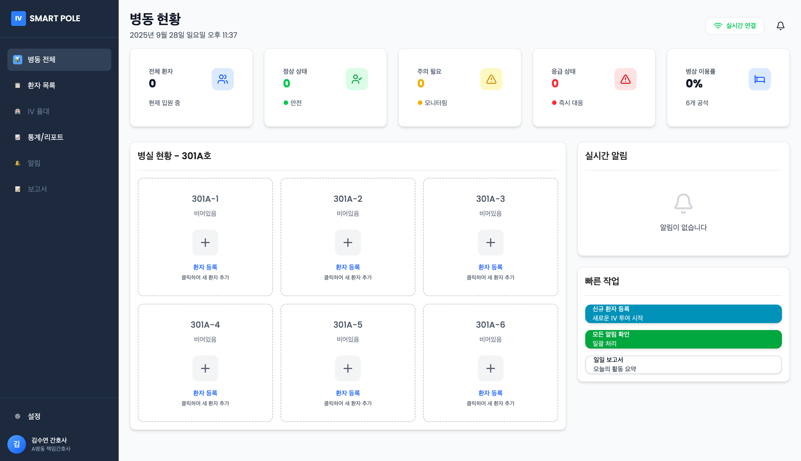
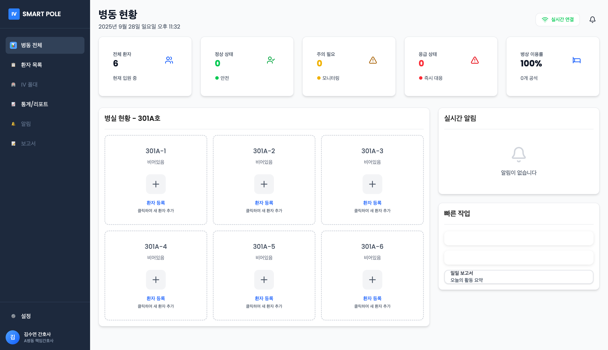

<div align="center">

<!-- 로고가 있다면:  -->

# 💧 Smart IV Pole

### IoT 기반 실시간 수액 모니터링 시스템

> 로드셀 센서로 **수액 잔량을 실시간 측정**하고, 소진 시점을 자동 예측·알림하여
> 간호 인력의 부담을 줄이고 투약 사고를 예방하는 스마트 링거 폴대입니다.

<br/>


<br/>


</div>

---

## 🖥 데모

<div align="center">

### 병동 통합 모니터링 대시보드
*병동 전체 환자의 수액 상태를 한 화면에서 실시간으로 모니터링*



### 병상 현황


</div>

<!-- 📱 Flutter 앱 화면을 추가하세요: docs/images/app-home.png 에 넣고 아래 주석을 해제하면 됩니다 -->
<!--
### 📱 모바일 앱
<div align="center">
  
  
</div>
-->

---

## 📑 목차

- [프로젝트 개요](#-프로젝트-개요)
- [주요 기능](#-주요-기능)
- [내가 맡은 역할](#-내가-맡은-역할)
- [시스템 아키텍처](#-시스템-아키텍처)
- [기술 스택](#-기술-스택)
- [빠른 시작](#-빠른-시작)
- [실행 방법 (상세)](#-실행-방법-상세)
- [API](#-api)
- [팀](#-팀)

---

## 📌 프로젝트 개요

기존 링거 폴대에 **로드셀(무게 센서) 모듈**을 부착하여, 수액의 무게 변화로 잔량을 실시간 산출하고
교체 시점을 예측해 자동으로 알리는 IoT 시스템입니다.

병원 현장에서는 간호사가 수액 잔량을 일일이 눈으로 확인해야 하고, 소진 시점을 놓치면
혈액 역류나 공기 색전 같은 위험이 발생할 수 있습니다. Smart IV Pole은 이 과정을 자동화하여
**현장의 실제 문제를 기술로 해결**하는 것을 목표로 했습니다.

| 기존 문제 | Smart IV Pole의 해결 |
|-----------|----------------------|
| 간호사가 수액 잔량을 수동으로 일일이 확인 | 로드셀 기반 실시간 자동 모니터링 |
| 수액 소진 시 혈액 역류·공기 색전 위험 | 잔량 부족 자동 알림으로 사고 예방 |
| 환자·보호자의 불안감 | 잔량·예상 소진 시간을 언제든 확인 |
| 병동 전체 상태 파악의 어려움 | 통합 대시보드로 한눈에 모니터링 |

---

## ✨ 주요 기능

| 기능 | 설명 |
|------|------|
| 🔋 **실시간 잔량 측정** | 로드셀(HX711) 무게 측정으로 수액 잔량을 정밀 산출 |
| ⏱ **소진 시간 예측** | GTT(점적 수) 계산으로 예상 소진 시간을 자동 예측 |
| 🔔 **자동 알림** | 잔량 부족 시 웹·앱으로 실시간 푸시 알림 |
| 📊 **통합 대시보드** | 병동 전체 환자를 한 화면에서 모니터링 |
| 🚦 **상태 시각화** | 잔량에 따른 색상 구분으로 우선순위 즉시 파악 |

**상태 표시 기준**

| 🟢 정상 | 🟡 주의 | 🔴 긴급 | ⚫ 오프라인 |
|:---:|:---:|:---:|:---:|
| 30% 이상 | 10–30% | 10% 미만 | 연결 끊김 |

---

## 👤 내가 맡은 역할

> **4인 팀 프로젝트**에서 아래 두 영역을 단독으로 설계·구현했습니다.

<table>
<tr>
<td width="50%" valign="top">

### 📱 Flutter 모바일 앱
`smart_iv_pole_app/`

- 환자·병동 수액 상태 모니터링 화면 구현
- 백엔드와 실시간 데이터 연동
- 잔량 부족 시 푸시 알림 처리

</td>
<td width="50%" valign="top">

### ⚖️ 로드셀 측정 알고리즘
`hardware/`

- HX711 센서 보정(calibration) 및 노이즈 필터링
- 센서 드리프트·크리프(creep) 보정으로 정확도 개선
- 무게 변화 기반 잔량·GTT 산출 로직

</td>
</tr>
</table>

<sub>📄 알고리즘 상세: <code>hardware/ALGORITHM_IMPROVEMENTS.md</code>, <code>hardware/CREEP_COMPENSATION_FIX.md</code></sub>

---

## 🏗 시스템 아키텍처

```
┌─────────────────┐         ┌─────────────────┐         ┌─────────────────┐
│   ESP8266       │  MQTT   │  Spring Boot    │   WS    │     Client      │
│   + Load Cell   │ ──────▶ │    Backend      │ ──────▶ │  React 웹 / 앱  │
│   (Hardware)    │         │   (REST API)    │         │  Flutter App    │
└─────────────────┘         └────────┬────────┘         └─────────────────┘
                                     │
                                     ▼
                            ┌─────────────────┐
                            │     MariaDB     │
                            └─────────────────┘
```

로드셀이 측정한 무게 데이터는 **MQTT**로 백엔드에 전송되고, 백엔드는 이를 가공·저장한 뒤
**WebSocket(STOMP)** 으로 웹·앱 클라이언트에 실시간으로 푸시합니다.

---

## 🛠 기술 스택

| 구분 | 기술 |
|------|------|
| **Backend** | Spring Boot 3.5.5 · Java 21 · Hibernate JPA |
| **Database** | MariaDB |
| **Frontend** | React 19 · TypeScript · Vite · Tailwind CSS · Zustand · TanStack Query |
| **Mobile** | Flutter |
| **Hardware** | ESP8266 · HX711 · Load Cell |
| **통신** | MQTT · WebSocket(STOMP) · REST API |
| **Infra** | Docker · AWS |

---

## ⚡ 빠른 시작

Docker로 전체 시스템을 한 번에 실행합니다.

```bash
git clone https://github.com/IksangJeong/Smart_IV_Pole.git
cd Smart_IV_Pole
docker-compose up -d
```

> 웹 대시보드: `http://localhost:5173` · 백엔드 API: `http://localhost:8081`

---

## 📦 실행 방법 (상세)

<details>
<summary><b>Backend (Spring Boot)</b></summary>

```bash
cd Smart_IV_Pole-be
./gradlew bootRun          # http://localhost:8081
```
</details>

<details>
<summary><b>Frontend (React)</b></summary>

```bash
cd frontend
npm install
npm run dev                # http://localhost:5173
```
</details>

<details>
<summary><b>Mobile (Flutter)</b></summary>

```bash
cd smart_iv_pole_app
flutter pub get
flutter run
```
</details>

<details>
<summary><b>Hardware (ESP8266)</b></summary>

1. Arduino IDE에서 `hardware/sketch_sep12a/` 열기
2. `config.h.example`을 복사해 `config.h`로 만들고 WiFi/서버 설정 입력
3. ESP8266 보드에 업로드
</details>

---

## 🔌 API

<details>
<summary><b>주요 엔드포인트 보기</b></summary>

| Method | Endpoint | 설명 |
|--------|----------|------|
| `GET`  | `/api/v1/patients` | 환자 목록 조회 |
| `POST` | `/api/v1/patients` | 환자 등록 |
| `GET`  | `/api/v1/drips` | 수액 종류 조회 |
| `POST` | `/api/v1/drips` | 수액 종류 등록 |
| `GET`  | `/api/v1/infusions` | 주입 세션 조회 |

</details>

---

## 📂 프로젝트 구조

```
Smart_IV_Pole/
├── Smart_IV_Pole-be/       # Spring Boot 백엔드 (REST API, WebSocket)
├── frontend/               # React 웹 대시보드
├── smart_iv_pole_app/      # Flutter 모바일 앱        👈 담당
├── hardware/               # ESP8266 펌웨어 + 로드셀 알고리즘  👈 담당
├── mqtt/                   # MQTT 브로커 설정
├── DB/                     # 데이터베이스 스키마
└── docker-compose.yml      # 통합 실행 환경
```

---

## 👥 팀

**동의과학대학교 컴퓨터정보학과 · 2025 졸업작품 (4인 팀)**

| 이름 | 역할 |
|------|------|
| **정익상** | Flutter 앱 개발 · 로드셀 측정 알고리즘 |
| 팀원 2 | <!-- 역할 입력 --> |
| 팀원 3 | <!-- 역할 입력 --> |
| 팀원 4 | <!-- 역할 입력 --> |

---

<div align="center">
<sub>This project is for educational purposes · 2025 Graduation Project</sub>
</div>
